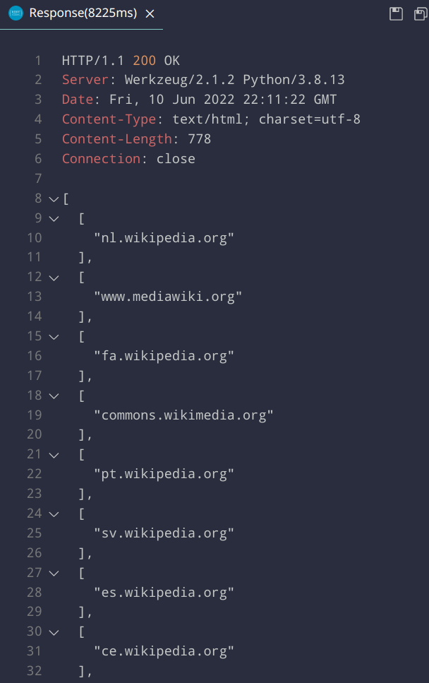
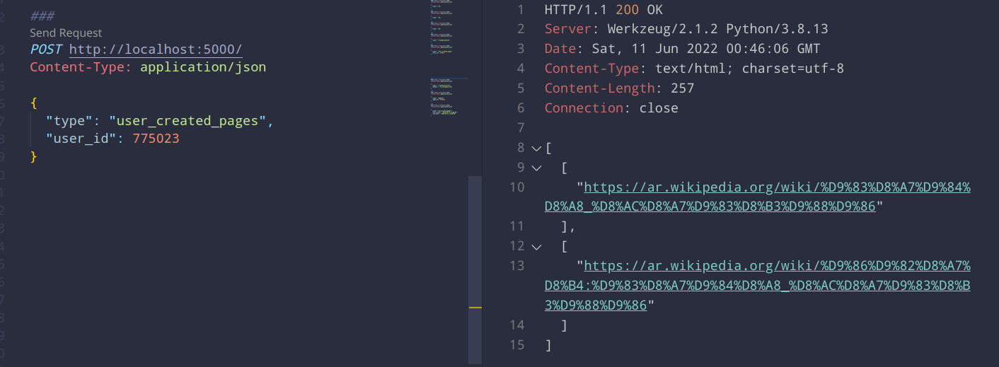
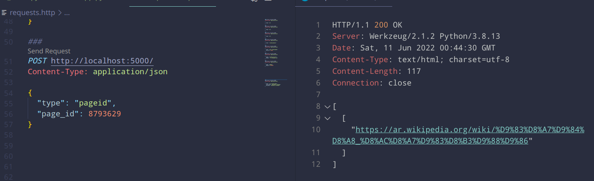
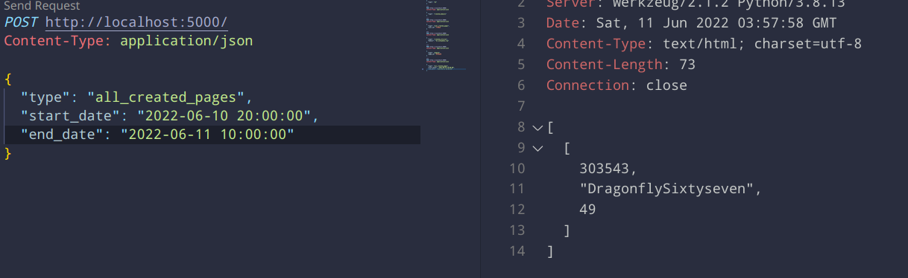
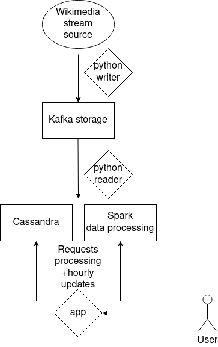

### Bilusyak Dmytro and Sultanov Andriy's Big Data project

### Usage

Launch Kafka and Spark

```
./run-kafka.sh
docker-compose up -d
```

Launch the writer (it will write the stream data into a Kafka topic):

```
./kafka_write.sh
./kafka_read.sh
./run-server.sh
```

To shut it all down:

```
docker-compose down
./shutdown-cluster.sh
```

### Examples

You can launch the requests from the `requests.http` file.

Here are the example requests:

B-1: Return the list of existing domains for which pages were created.



B-2: Return all the pages which were created by the user with a specified user_id.



B-3: Return the number of articles created for a specified domain.


B-4: Return the page with the specified page_id



B-5: Return the id, name, and the number of created pages of all the users who created
at least one page in a specified time range.



### Diagram of the project architecture



### Data model

Since we are operating with live streaming that can potentially require big data processing
and definitely requires no downtimes, and since we wanted to experiment early on with 
table schemas and not necessarily define them first, We chose a Cassandra NoSQL storage.

Our Cassandra storage serves to process and store our data on the go.

There are three tables that are filled up with every stream response:

- created_domains (queries B-1 and B-3)
	- domain
	- url
- pages_by_userid (queries B-2 and B-5)
	- user_id
	- user_text
	- url
	- date
- pageids (queries B-4)
	- page_id
	- url

And three tables for the pre-computed data that follow the schema defined in the requirements:

- category_a_1
- category_a_2
- category_a_3

These are then simply queried when the app processes the user's request.
